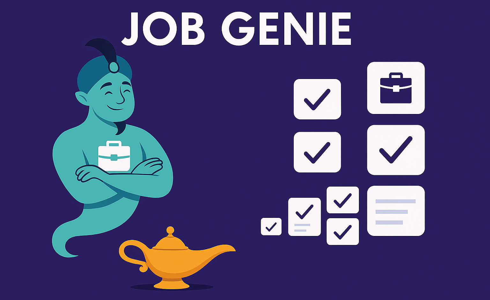

# 🧞 JobGenie NLP Recommender

> **AI-powered Resume-to-Job Matching System**  
A recommender system that reads your resume, extracts key skills and experiences, and matches you to the most relevant job postings using **NLP + Semantic Search**.

---

<p align="center">
  
</p>
*Smart recommendations based on your resume.*

---

## 🚀 Project Overview
JobGenie is a **resume-based job recommender** that combines:
- **Keyword Heuristics** – Regex + rule-based filters for years of experience and role matching.  
- **Semantic Matching** – Transformer embeddings for skill similarity and context understanding.  
- **Interactive UI** – Streamlit interface with dynamic filters (title, location).  

This project demonstrates how **NLP pipelines and semantic embeddings** can streamline the hiring process by reducing resume–job mismatch.

---

## ✨ Highlights
- 📝 **Resume Parsing** – Extracted skills using **spaCy** and **PDFMiner**.  
- 🔍 **Semantic Search** – Matched resumes to **25K+ job postings** using **Transformers (Sentence-BERT)**.  
- ⚡ **Regex Parsing** – Extracted experience & ranked profiles with heuristic scoring.  
- 🎛 **Streamlit App** – Interactive job recommender with title/location filters.  
- 📊 **Hybrid Approach** – Combined keyword + semantic ranking for improved recommendations.  

---

## 🛠️ Tech Stack
- **Languages & Frameworks**: Python, Streamlit  
- **Libraries**: spaCy, PDFMiner, HuggingFace Transformers  
- **NLP Techniques**: Named Entity Recognition (NER), Regex, Embedding Similarity  
- **Other Tools**: Pandas, Scikit-learn  

---

## ⚡ Quick Start

### 1️⃣ Clone the Repository
```bash
git clone https://github.com/harshitmehra1/jobGenie.git
cd jobGenie

